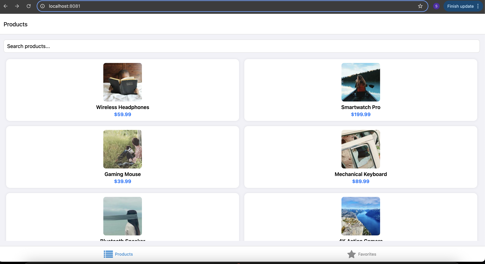

# eCommerceApp

## Project Setup Instructions

1. **Install dependencies**
    ```sh
    npm install
    ```
2. **Run on iOS**
    ```sh
    npx expo run:ios
    ```
3. **Run on Android**
    ```sh
    npx expo run:android
    ```
4. **Run on Web**
    ```sh
    npm run web
    ```

## Project Overview

eCommerceApp is a cross-platform e-commerce demo app built with React Native, Expo and TypeScript. It demonstrates a modern shopping experience with product listing, details, favorites, and deep linking.

**Technologies Used**
- Expo (React Native)
- TypeScript
- Redux Toolkit
- Redux thunk
- AsyncStorage
- Expo Router
- Jest & @testing-library/react-native

**Key Features**
- Product list with search and responsive grid/list layout
- Product details with favorite toggle
- Favorites screen with real-time updates
- Persistent favorites (AsyncStorage)
- Deep linking (web and native)
- Accessibility and responsive design

## Technical Decisions & Architecture

### State Management
- **Redux Toolkit** is used for global state (products, favorites) for predictable state and easy debugging.

### Component Architecture
- Screens are organized by feature (ProductList, ProductDetails, Favorites).
- Expo Router is used for file-based navigation and deep linking.

### Data Persistence
- **AsyncStorage** is used to persist favorites across app restarts on all platforms.
- Redux state is hydrated from AsyncStorage on app start.

### Performance Considerations
- FlatList is used for efficient product rendering.
- Async actions are debounced and loading states are managed for smooth UX.
- Filtering computations are memoized using useMemo()

### Security Considerations
- No sensitive data is stored.
- AsyncStorage is used for non-sensitive, user-specific preferences only.

### Testing Strategy
- Jest and @testing-library/react-native for unit and integration tests.
- Coverage includes reducers, async logic, and UI interactions.

## Screenshots / GIFs

- **List Screen**: _Product list with search and grid/list layout_
   
- **Details Screen**: _Product details and favorite toggle_
   
- **Favorites Screen**: _Favorited products_
   
- **Responsive Design**: _Web (2 columns) vs Mobile (1 column)_
   
   
   
- **Deep Link Demo**: _Open product details via deep link_
   
   
   
   
